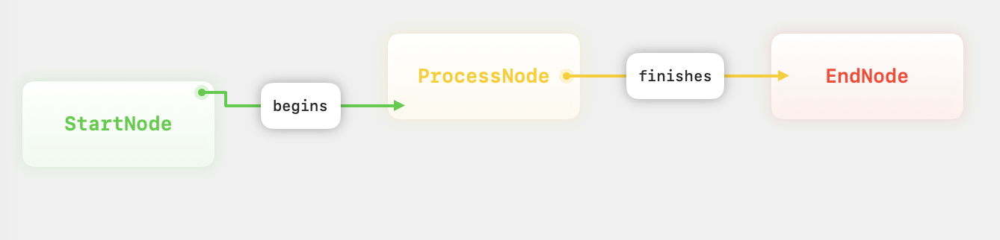
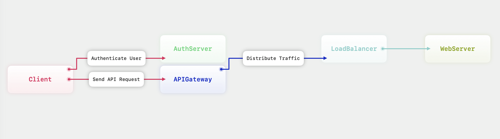
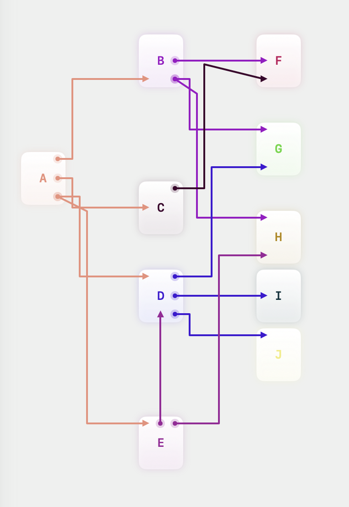

<p align="center">
  
</p>

# Corner
Corner is an open-source macOS app designed to transform structured text into stunning diagrams

# Table of Contents

- [Installation](#installation)
- [Corner Language Documentation](#corner-language-documentation)
    - [Language Overview](#language-overview)
        - [Grammar Summary](#grammar-summary)
    - [Key Elements](#key-elements)
      - [Node Declaration](#node-declaration)
      - [Node Attributes](#node-attributes)
      - [Edge Declaration](#edge-declaration)
      - [Edge Attributes](#edge-attributes)
      - [Combining Nodes and Edges](#combining-nodes-and-edges)
- [Complete Example](#complete-example)
- [Known Issues](#known-issues)

# Installation

You can easily install **Corner** by downloading the latest release from the [Releases](https://github.com/your-repo/releases) section of this repository.

1. Go to the [Releases](https://github.com/mori-ahk/Corner/releases) page.
2. Download the `.dmg` file for the latest version.
3. Open the file and follow the instructions to install Corner on your macOS device.
4. If you run into a warning regarding "unidentified developer". Follow this [link](https://support.apple.com/en-ca/guide/mac-help/mh40616/mac).
5. Launch Corner.

# Corner Language Documentation

Corner language is a simple and flexible way to define diagrams in Corner, an open-source macOS app. This language allows you to define nodes and edges with customizable attributes like colors and labels. Below is a detailed breakdown of the grammar and how to use it effectively.

## Language Overview

In Corner language, you define diagrams by declaring nodes and edges. Nodes can have attributes like colors, and edges can have labels. Every diagram starts with at least one node declaration, and nodes can connect to each other through edges.

### Grammar Summary

```bnf
<Diagram> ::= <NodeDeclaration>

<NodeDeclaration> ::= "node" <identifier> "{" (<NodeAttributes> | | <EdgeDeclaration>)* "}"
<EdgeDeclaration> ::= "calls" <identifier> <EdgeAttributes>

<NodeAttributes> ::= <ColorAttribute>*
<EdgeAttributes> ::= <LabelAttribute>*
<ColorAttribute> ::= "color" ":" <identifier>
<LabelAttribute> ::= "label" ":" "\"" <identifier> "\""

<identifier> ::= [a-zA-Z][a-zA-Z0-9]*
```

### Key Elements

#### Node Declaration

A node in Corner language is declared using the node keyword, followed by an identifier that names the node. The identifier must start with a letter (a-z or A-Z) and can be followed by any combination of letters and digits.

##### Syntax

```
node <identifier> {
  <NodeAttributes>*
  <EdgeDeclaration>*
}
```

- <**identifier**>: A name for the node, e.g., `node1`, `process`, or `StartNode`.
- The node’s body contains either its attributes or edges to other nodes, and both can appear together or alone

##### Example

```
node StartNode {}
```

This example declares a node named `StartNode`.

#### Node Attributes

Node attributes customize the appearance of nodes. Currently, the only supported attribute is `color`.

##### Syntax

```
color: <identifier>
```

- <**identifier**>: A color name (e.g., red, blue, green). This defines the color of the node.

###### List of all available colors:

```
blue
yellow
red
green
orange
indigo
black
white
mint
cyan
purple
pink
```

> [!NOTE]  
> If color is not specified, Corner will assign a random color to the node.


##### Example

```
node Process {
  color: red
}
```

This declares a node `Process` with the color red.

#### Edge Declaration

Edges connect nodes and represent relationships. Edges are declared inside a node, using the `calls` keyword, followed by the target node’s identifier. Edges can have a label attribute to describe the relationship.

##### Syntax

```
calls <identifier> {
  <EdgeAttributes>*
}
```

- <**identifier**>: The name of the target node to which the current node is connected.
- The body of the edge can contain attributes, such as a label.

##### Example

```
node StartNode {
  calls Process {
    label: "initiates"
  }
}
```

This example declares that the node `StartNode` calls the node `Process` with the label “initiates.”

#### Edge Attributes

Edge attributes define characteristics of the connection between two nodes. The currently supported edge attribute is label, which is a string enclosed in double quotes.

##### Syntax

```
label: "<identifier>"
```

- <**identifier**>: Any descriptive string for the edge, representing the relationship or action.

##### Example

```
calls EndNode {
  label: "completes"
}
```

This example declares that the edge between the current node and `EndNode` has the label “completes.”

#### Combining Nodes and Edges

Nodes can have both attributes and edges. Below is an example combining node color and an edge with a label:

```
node StartNode {
  color: green
  calls ProcessNode {
    label: "begins"
  }
}
```

This creates a `StartNode` with a green color and an edge to `ProcessNode` labeled “begins.”

### Complete Example

```
node StartNode {
  color: green
  calls ProcessNode {
    label: "begins"
  }
}

node ProcessNode {
  color: yellow
  calls EndNode {
    label: "finishes"
  }
}

node EndNode {
  color: red
}
```

#### Breakdown

1. `StartNode` is green and connects to `ProcessNode` with the label “begins”.
2. `ProcessNode` is yellow and connects to `EndNode` with the label “finishes”.
3. `EndNode` is red and doesn’t connect to any other nodes.

##### Generated Example Diagram



#### Other Examples




##### Known Issues

1. If two nodes are aligned either vertically or horizontally, and their edges form a cycle, the edges may overlap.

For more advanced diagrams, future updates may add new attributes and features. Keep checking the repository for updates!
